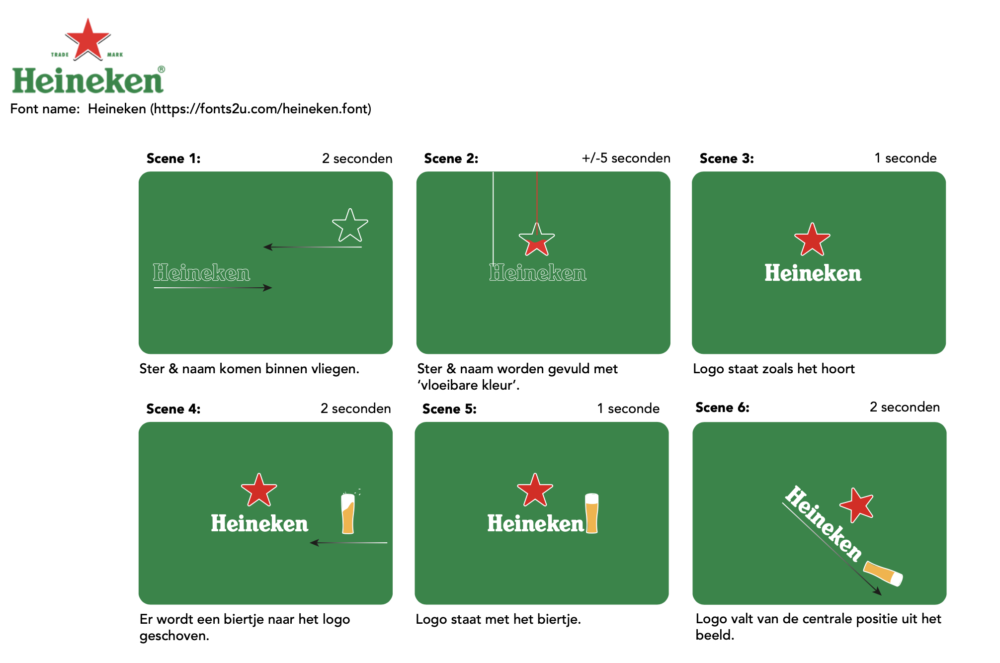
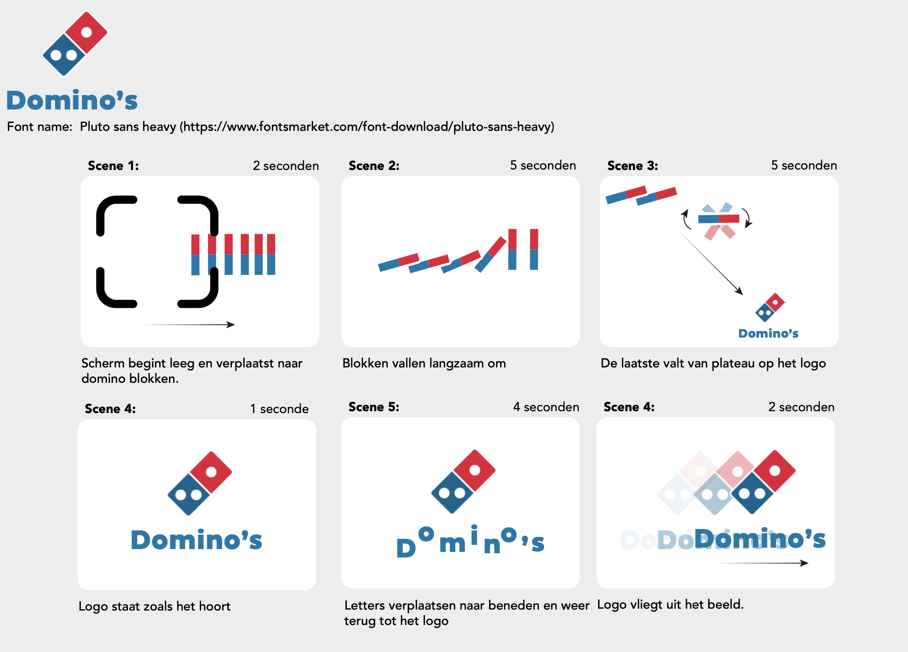
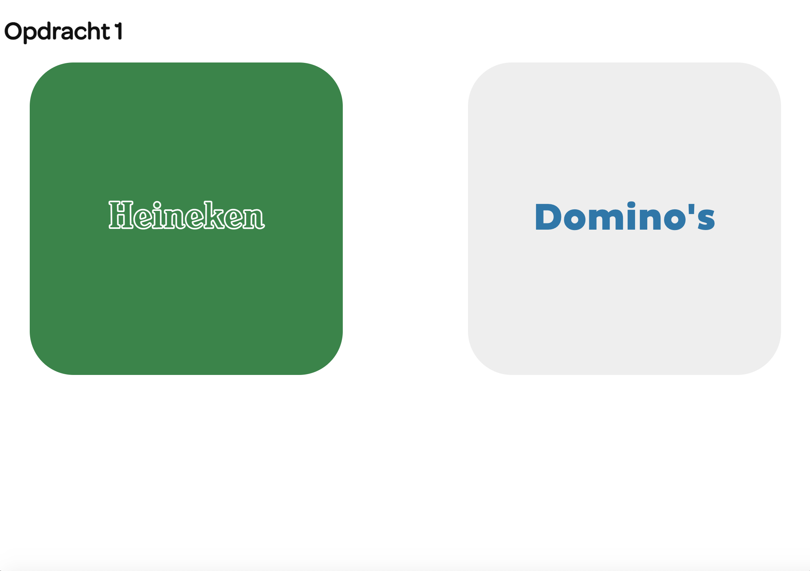
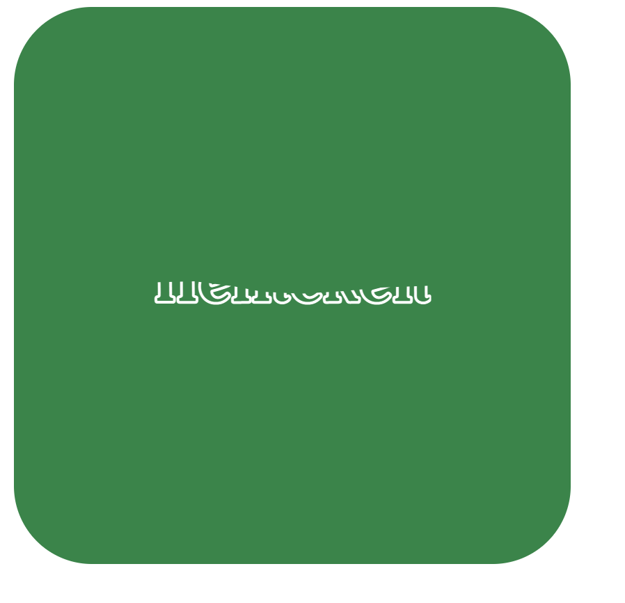

# Procesverslag
**Auteur:** -Ian Hoogenboom-

**Het werk:** [opdracht 1](opdracht1/index.html) en [opdracht 2](opdracht2/index.html)

### Week 1

In de eerste week hebben we gewerkt aan een paar oefeningen over animeren van css en custom properties. Tijdens de les had ik dit nog niet af, dus ik heb het na de les afgemaakt.
De oefeningen waren niet heel moeilijk en ik kon het zonder grote probleem afronden.

### Week 2

Ter voorbereiding van deze week moesten we storyboards van de eerste opdracht op miro plaatsen.
Door het in kleine stappen voor te bereiden wordt het uiteindelijk makkelijker om de logo's te animeren. Ik heb gekozen voor het logo van Heineken en Domino's.

<!--

-->

## Je 'posts' (je code-dagboek)

Voortgangsgesprek 1 post:

In dit voortgangsgesprek was ik van plan om vragen te stellen over een animatie van het heineken logo (vol vloeien van letters). Ik was hier al aan begonnen maar kwam er niet helemaal uit. Daarnaast was ik begonnen met het grid waar de animaties in komen en heb ik dmv fontface gedownloade fonts in mijn code geplaatst. Dit was allemaal niet perse makkelijk maar was in principe goed te doen. Voor het volgende gesprek ben ik van plan om verder te werken met het inschuiven van de letters en probeer ik zover mogelijk te komen met het eerste logo.

<!--

-->

## Bronnenlijst
1. - https://www.fontsmarket.com/font-download/pluto-sans-heavy -
2. - https://allyourfonts.com/font/heineken-font/ -
3. - https://bennettfeely.com/clippy/ -
